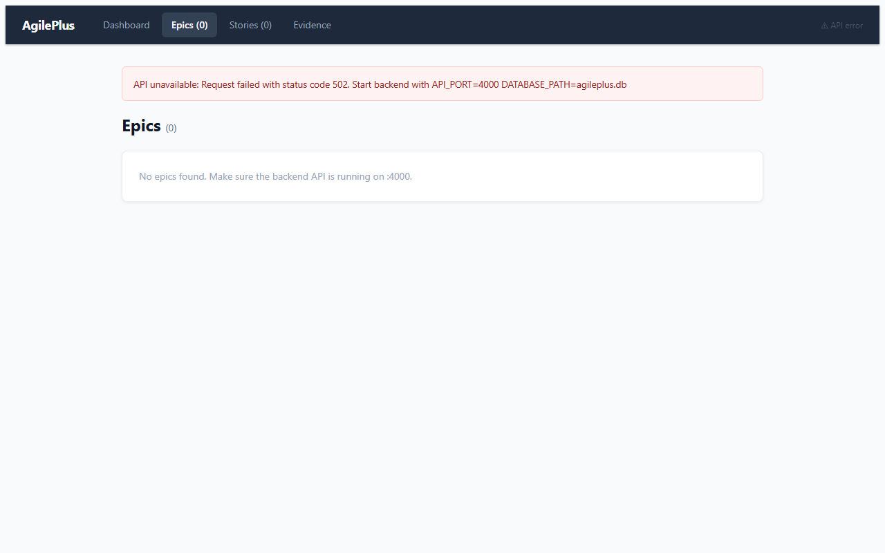
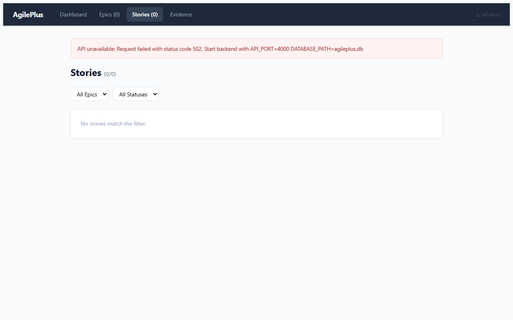
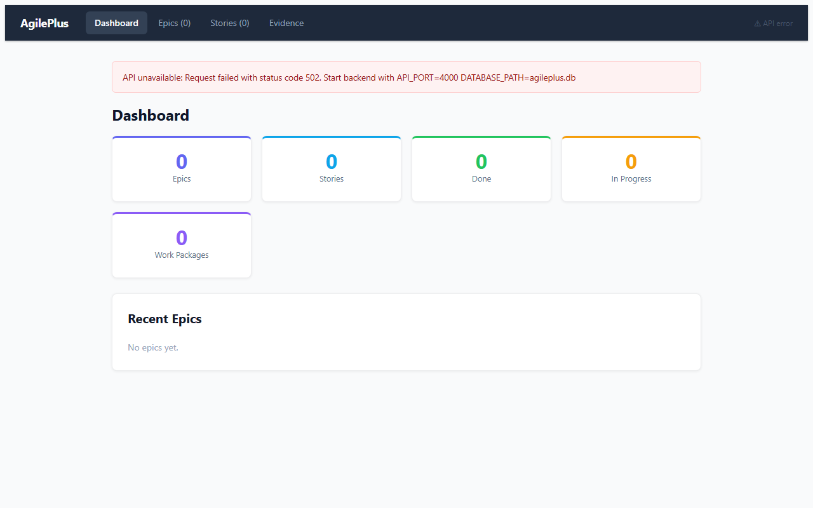

> **Work state:** ACTIVE · **Progress:** `███████░░░ 70%`
> AI-native spec-driven PM platform (28-crate Rust workspace + React/TS dashboard + Electrobun desktop); frontend candidate #1. Core domain/api/dashboard implemented (421 Rust files); CI partially red, README/CLAUDE below describe a stale "polyrepo shelf" era and need a rewrite to match the shipped product. · updated 2026-06-02

# Phenotype Polyrepo Shelf

> **Pinned references (Phenotype-org)**
> - MSRV: see `rust-toolchain.toml`
> - cargo-deny config: see `deny.toml`
> - cargo-audit: `rustsec/audit-check@v2` weekly
> - Branch protection: 1 reviewer required, no force-push
> - Branching baseline: canonical repo checkout should stay on `main` unless doing merge/pull
> - Governance authority: `phenotype-org-governance/SUPERSEDED.md` when present in the relevant repo

This root is a **polyrepo shelf** for the Phenotype organization: one workspace directory containing many independent repositories, landing pages, shared libraries, and operational runbooks. It is intentionally a central index, not a replacement for each project's README.

`projects/INDEX.md` has been checked and is currently missing, so this README acts as the shelf index.

## About this shelf

- **Canonical repository layout:** each first-level directory ending in a normal project name is the canonical checkout for that project.
- **Feature work:** perform feature work in project worktrees under `*-wtrees/` and keep canonical directories aligned to `main`.
- **Cross-project standards:** quality, spec, and governance expectations are documented in shelf-level docs and project-specific AGENTS/CLAUDE files.
- **Per-repo docs first:** the README in each project folder is authoritative for setup, build, and workflow.

## Getting Started

1. Pick a project directory from the table below.
2. Open that project's own README (`<project>/README.md`).
3. For any active implementation, use the project worktree under `<project>-wtrees/`.
4. Track implementation work in this shelf's AgilePlus feature specs:
   - [AgilePlus specs](AgilePlus/kitty-specs/) (spec index)
   - [Shelf worklogs](docs/worklogs/README.md)
5. Use shelf docs for cross-project context:
   - `docs/` for org policies, ADRs, and process references
   - `docs/worklogs/` for ADR-like decisions, research notes, and issue findings

## Major repos and project index

This is a curated index of the most active/major repos in this checkout.

### AgilePlus (shelf tracking)

| Project | Description |
|---|---|
| [AgilePlus](AgilePlus/) | Local-first spec-driven agile work-tracking CLI/platform for AI-agent and human teams; manages feature specs, work packages, acceptance criteria, optional GitHub sync, dashboards, and P2P merge. Install from `AgilePlus/` with `cargo install --path crates/agileplus-cli`; see `AgilePlus/README.md`. |

### Agent orchestration and LLM execution

| Project | Description |
|---|---|
| [thegent](thegent/) | Agent runtime and decomposition framework for multi-actor execution. |
| [thegent-dispatch](thegent-dispatch/) | Dispatch service for routing worker workloads across providers. |
| [thegent-workspace](thegent-workspace/) | Workspace scaffolding and state model for thegent. |
| [thegent-landing](thegent-landing/) | Marketing/landing site for thegent. |
| [cheap-llm-mcp](cheap-llm-mcp/) | MCP server for routing low-cost model usage. |
| [dispatch-mcp](dispatch-mcp/) | Single endpoint MCP dispatch utility. |
| [agentapi-plusplus](agentapi-plusplus/) | API gateway and protocol adapters for agent workflows. |
| [agent-user-status](agent-user-status/) | Presence/status service for user-facing agent interactions. |
| [agent-devops-setups](agent-devops-setups/) | Provisioning and orchestration setup helpers. |
| [agentops-policy-federation](agentops-policy-federation/) | Cross-agent policy federation. |
| [Agentora](Agentora/) | Agent orchestration product. |
| [PhenoAgent](PhenoAgent/) | Agent SDK for the Phenotype runtime. |
| [phenoForge](phenoForge/) | Phenotype-flavored Forge integrations. |
| [forgecode](forgecode/) | Forge agent integration scaffolding. |

### MCP, APIs, and routing infrastructure

| Project | Description |
|---|---|
| [agileplus-mcp](agileplus-mcp/) | MCP integration surface for AgilePlus. |
| [AgentMCP](AgentMCP/) | Experimental MCP scaffolding repository. |
| [McpKit](McpKit/) | MCP server scaffolding kit. |
| [MCPForge](MCPForge/) | MCP server forge tooling. |
| [cliproxyapi-plusplus](cliproxyapi-plusplus/) | Multi-provider CLI proxy and API compatibility surface. |
| [helios-router](helios-router/) | Routing layer for LLM/agent requests. |
| [helios-cli](helios-cli/) | CLI client for Helios workflows. |
| [helioscope](helioscope/) | App manager (formerly heliosCLI). |
| [PhenoMCP](PhenoMCP/) | MCP runtime and plugin scaffolding. |
| [vibeproxy](vibeproxy/) | LLM/dev traffic proxy. |
| [vibeproxy-monitoring-unified](vibeproxy-monitoring-unified/) | Unified monitoring stack for vibeproxy. |
| [Httpora](Httpora/) | HTTP utilities/proxy. |

### Core platform + shared crates

| Project | Description |
|---|---|
| [pheno](pheno/) | Core Phenotype platform workspace (multiple subproducts). |
| [phenoShared](phenoShared/) | Shared cross-repo Rust crates and helpers. |
| [PhenoRuntime](PhenoRuntime/) | Runtime abstractions used across Phenotype components. |
| [PhenoControl](PhenoControl/) | Control-plane primitives and policy wiring. |
| [PhenoSchema](PhenoSchema/) | Shared schema and contract types. |
| [PhenoPlugins](PhenoPlugins/) | Plugin framework and extension points. |
| [PhenoKits](PhenoKits/) | Kit-level tool and artifact collection (umbrella). |
| [PhenoEvents](PhenoEvents/) | Event bus and signal model. |
| [PhenoLang](PhenoLang/) | Language/tooling support. |
| [PhenoCompose](PhenoCompose/) | Composition and orchestration helpers. |
| [phenotype-shared](phenotype-shared/) | Historical alias path for shared crates (same repo as phenoShared). |

### Product applications

| Project | Description |
|---|---|
| [heliosApp](heliosApp/) | Product application workspace for helios. |
| [HeliosLab](HeliosLab/) | Experimentation and analytics workspace for helios. |
| [heliosBench](heliosBench/) | Benchmarking project for helios execution performance. |
| [BytePort](BytePort/) | Network transport and endpoint-oriented product. |
| [Tokn](Tokn/) | Token operations and pricing governance. |
| [Tracera](Tracera/) | Traceability system for event and execution history. |
| [Observably](Observably/) | Product-level observability surface. |
| [hwLedger](hwLedger/) | Hardware and capacity ledger for fleet/operations planning. |
| [PolicyStack](PolicyStack/) | Governance/policy engine and compliance tooling. |
| [Planify](Planify/) | Planning utilities and work lifecycle helpers. |
| [Sidekick](Sidekick/) | Assistant-side operational helper. |
| [Eidolon](Eidolon/) | Phenotype's Eidolon domain project. |

### Tooling and infrastructure

| Project | Description |
|---|---|
| [FocalPoint](FocalPoint/) | Central operations tooling, including target-pruner utilities. |
| [Configra](Configra/) | Configuration management framework. |
| [Conft](Conft/) | Flag/config control service. |
| [PhenoObservability](PhenoObservability/) | Logging, tracing, telemetry, and monitoring stack. |
| [ObservabilityKit](ObservabilityKit/) | Reusable observability building blocks. |
| [PlatformKit](PlatformKit/) | Cross-platform platform utilities. |
| [HexaKit](HexaKit/) | Architecture and scaffolding utilities. |
| [phenotype-infra](phenotype-infra/) | Infrastructure-as-code and org automation. |
| [phenoAI](phenoAI/) | AI service integrations and helpers. |
| [ValidationKit](ValidationKit/) | Validation and policy checks. |
| [TestingKit](TestingKit/) | Test scaffolding and quality helpers. |
| [rich-cli-kit](rich-cli-kit/) | Rich terminal UX helpers. |
| [ResilienceKit](ResilienceKit/) | Resilience patterns library. |
| [Tracely](Tracely/) | Trace explorer. |
| [Metron](Metron/) | Metric collection service. |
| [Tasken](Tasken/) | Task scheduler. |
| [Civis](Civis/) | Civis project. |
| [Benchora](Benchora/) | Benchmarking service. |
| [QuadSGM](QuadSGM/) | QuadSGM project. |
| [localbase3](localbase3/) | Local DB / storage layer. |
| [KDesktopVirt](KDesktopVirt/) | Desktop virtualization. |
| [bare-cua](bare-cua/) | Bare computer-use-agent harness. |
| [PlayCua](PlayCua/) | Computer-use agent playground. |
| [AppGen](AppGen/) | App generator. |
| [DevHex](DevHex/) | DevHex product. |
| [Dino](Dino/) | Dinoforge core. |
| [dinoforge-packs](dinoforge-packs/) | Dinoforge governance packs. |
| [DINOForge-UnityDoorstop](DINOForge-UnityDoorstop/) | Unity Doorstop integration. |
| [KlipDot](KlipDot/) | KlipDot product. |
| [Pine](Pine/) | Pine project. |
| [Parpoura](Parpoura/) | Parpoura project. |
| [Paginary](Paginary/) | Pagination service. |
| [netweave-final2](netweave-final2/) | Netweave experiment. |
| [foqos-private](foqos-private/) | Foqos (private). |
| [argis-extensions](argis-extensions/) | Argis editor extensions. |
| [AtomsBot](AtomsBot/) | Atoms bot (archived; retained for history). |
| [chatta](chatta/) | Chatta workspace. |
| [portage](portage/) | Portage workspace. |
| [portage-adapter-core](portage-adapter-core/) | Portage adapter core. |
| [nanovms](nanovms/) | NanoVM integration. |
| [GDK](GDK/) | Game/graphics dev kit. |
| [DataKit](DataKit/) | Data-pipeline kit. |
| [AuthKit](AuthKit/) | Auth kit. |
| [kwality](kwality/) | Quality / scorecard tooling. |
| [phenoUtils](phenoUtils/) | Shared utilities. |
| [phenoDesign](phenoDesign/) | Design system primitives. |
| [phenodocs](phenodocs/) | Phenotype documentation site. |
| [phenodocs-scorecard-remediation](phenodocs-scorecard-remediation/) | Doc scorecard remediation harness. |
| [PhenoHandbook](PhenoHandbook/) | Phenotype handbook. |
| [phenotype-auth-ts](phenotype-auth-ts/) | TypeScript auth client. |
| [phenotype-bus](phenotype-bus/) | Message bus. |
| [phenotype-hub](phenotype-hub/) | Discovery / registry hub. |
| [phenotype-registry](phenotype-registry/) | Artifact registry. |
| [phenotype-journeys](phenotype-journeys/) | User-journey traceability. |
| [phenotype-omlx](phenotype-omlx/) | OMLX integration. |
| [phenotype-ops-mcp](phenotype-ops-mcp/) | Ops MCP surface. |
| [phenotype-org-audits](phenotype-org-audits/) | Org-wide audit reports. |
| [phenotype-tooling](phenotype-tooling/) | Cross-repo tool chest. |
| [phenotype-icons](phenotype-icons/) | Icon set. |
| [phenotype-previews-smoketest](phenotype-previews-smoketest/) | Preview/smoketest harness. |
| [phenotype-skills](phenotype-skills/) | Claude skill definitions. |
| [phenoXdd](phenoXdd/) | XDD (cross-document development) tooling. |
| [phenoResearchEngine](phenoResearchEngine/) | Research automation engine. |

### Landing pages and web surfaces

| Project | Description |
|---|---|
| [agileplus-landing](agileplus-landing/) | Marketing/landing site for AgilePlus. |
| [byteport-landing](byteport-landing/) | Marketing/landing site for BytePort. |
| [hwledger-landing](hwledger-landing/) | Marketing/landing site for hwLedger. |
| [phenokits-landing](phenokits-landing/) | Marketing/landing site for PhenoKits. |
| [projects-landing](projects-landing/) | Organization-wide projects landing page. |
| [frontend](frontend/) | Shelf-level frontend app surface. |

### Cross-cutting shelves and references

| Path | Purpose |
|---|---|
| `docs/worklogs/` | Shelf-wide worklog index by category (`ARCHITECTURE`, `RESEARCH`, `GOVERNANCE`, etc.). |
| `AgilePlus/kitty-specs/` | Feature specs and task packages used by AgilePlus. |
| `docs/` | Shared references, ADRs, and reusable docs. |
| `*-wtrees/` | Project worktree directories (e.g. `AgilePlus-wtrees/`). |
| `.github/scripts/` | Shared CI and maintenance scripts. |
| `AgilePlus/` | Main platform implementation. |

## Notes

- Some directories are placeholders/landing/utility trees and may not represent standalone canonical products.
- This README is intentionally a shelf-level index; source-of-truth setup for each project stays in that project's own `README.md`.
- This index does not remove information from previous versions; it reorganizes it for polyrepo orientation and easier navigation.

---

## Rich Media Stubs

<!-- RICH-MEDIA-STUB type="annotated-screenshot" subject="AgilePlus quickstart — agileplus status after first epic created" journey="quickstart-cli" status="TODO" -->
> **[RICH MEDIA PLACEHOLDER — blocked on CLI build]** *Terminal capture of `agileplus status` immediately after `agileplus init` + `agileplus epic create`.*
>
> **Blocked:** `agileplus-cli` is not yet published from this workspace (`cargo build -p agileplus-cli` is the unlock). Once the binary exists, record via `Capture` in a Playwright or `script` session and render with `phenotype-journeys/remotion/doc-embeds/bin/render.mjs`. **Workaround:** use the web dashboard captures above for onboarding visuals until the CLI journey lands.
<!-- END-RICH-MEDIA-STUB -->

<!-- RICH-MEDIA-STUB type="recording-gif" subject="Epic/Story lifecycle — create epic, break into stories, assign" journey="epic-story-lifecycle" status="CAPTURED" -->

*Keyframe pair from the `epic-story-lifecycle` Playwright capture (`docs/embeds/journeys/epic-story-lifecycle.annotations.json`). Remotion mp4/gif render is queued once `API_PORT=4000` is up with seeded data; re-run `render.mjs` from `phenotype-journeys/remotion/doc-embeds` to publish the animated loop.*
<!-- END-RICH-MEDIA-STUB -->

<!-- RICH-MEDIA-STUB type="recording-mp4" subject="Dashboard walkthrough — AgilePlus web dashboard all panels" journey="dashboard-walkthrough" status="PUBLISHED" -->

*Three-step dashboard walkthrough captured via `@phenotype/doc-embeds` Capture helper (Overview → Epics → Stories). EmbedSpec: `docs/embeds/journeys/dashboard-walkthrough.annotations.json`. Re-capture with `API_PORT=4000 DATABASE_PATH=agileplus.db` for live epic/story counts, then `npm run render -- --annotations …` in `phenotype-journeys/remotion/doc-embeds` to drop `dashboard-walkthrough.mp4` beside these stills.*
<!-- END-RICH-MEDIA-STUB -->
